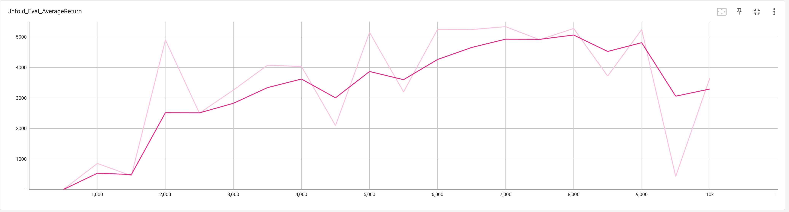
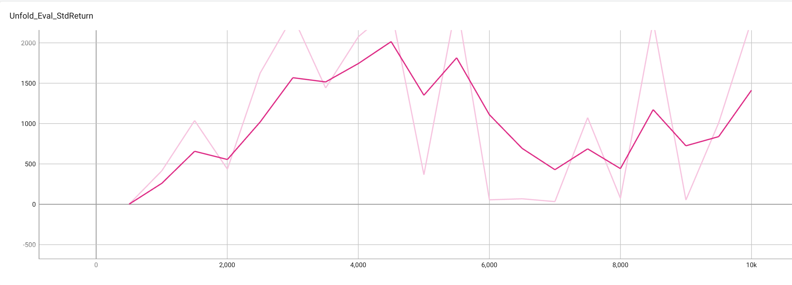
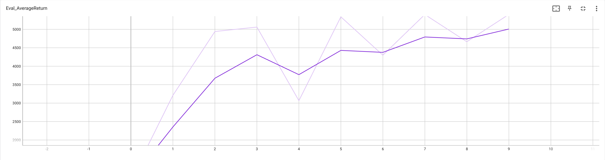
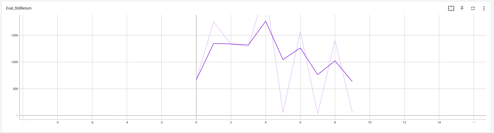

# HW1 Behavioral Cloning Report

This report is copied from https://github.com/mdeib/berkeley-deep-RL-pytorch-solutions/tree/master/hw1 (I used my own data and added some notes only)

Below is the HW1 report. All data used can be found in the results folder - videos aren't included to save space. To view the tensorboard for a specific part navigate to that part's folder (not the subfolders) and run 
```commandline
tensorboard --logdir .
```

## Question 1.2

The agent was trained on 1000 steps of expert behavior in each environment (v4) and was evaluated for 10000 steps to get an accurate mean performance. The agent itself had an MLP policy consisting of 2 hidden layers of 64 neurons each (default value).

| Environment |      Expert      | Behavioral Cloning | Mean Percent Performance |
|-------------|:----------------:|:------------------:|:------------------------:|
| Ant         |  4722 ± 146.4  |   4319 ± 1227  |          91.46%          |
| HalfCheetah |  4080 ± 82.4 |  3970 ± 110.8  |          97.30%          |
| Hopper      |  3718 ± 1.787  |   1156 ± 163   |          31.09%          |
| Walker2d    |  4815 ± 1130  |    928 ± 671.6   |           19.27%          |

From the table the agent achieved > 30% performance in Ant, HalfCheetah, and Hopper. The Walker2d env is somehow more difficult but not too much as the agent can fit well simply for more training steps (see 1.3)

## Question 1.3

I originally set the training steps to be 10000 and the agent was able to achieve > 70% performance for every environment, which is a little skeptical and didn't match the trend of mdeib's experiments . Therefore, I lower the training steps and found the trend matched. I suggest that this could result from the change made to the homework.
For this question we will graph evaluation performance as a function of training steps. A data point was taken every 500 training steps, and it was trained for a total of 10000 steps. The mean returns throughout training are shown below:



It can be seen that the agent was able to improve greatly with more training updates. Also notable is the significant initial time it took to actually begin performing.



While average performance seems to be quite good, the standard deviation over the course of training is a bit more telling, as is the min/max returns. The agent continues to have trials where it makes a mistake and is unable to recover, resulting in a terrible rollout and a large standard deviation. If the agent was really learning to perform well in the environment we would see the standard deviation fall as it begins to consistently do well. This perfectly illustrates the weaknesses of behavioral cloning, and leads into question 2.2.

## Question 2.2

For this question dagger learning was done on the Walker2d environment used in question 1.3. In the first 1000 steps behavioral cloning was done, after which 9 iterations of dagger were carried out. Thus a total of 10k training steps were done, just like in question 1.3. All other things were kept the same. This allows the usage of dagger to be fairly tested. The average returns are below:



It can be seen that using dagger instead of training behavioral cloning further yielded better average returns. This is good but the real test is the standard deviation:



Unlike in question 1.3 the standard deviation drops dramatically as more dagger iterations are done. This shows that dagger has taught the agent to actually correct its mistakes, instead of failing as soon as it deviates slightly from the experts path. Thus dagger is shown to provide agent robustness that pure behavioral cloning fails to give.